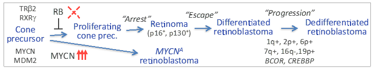
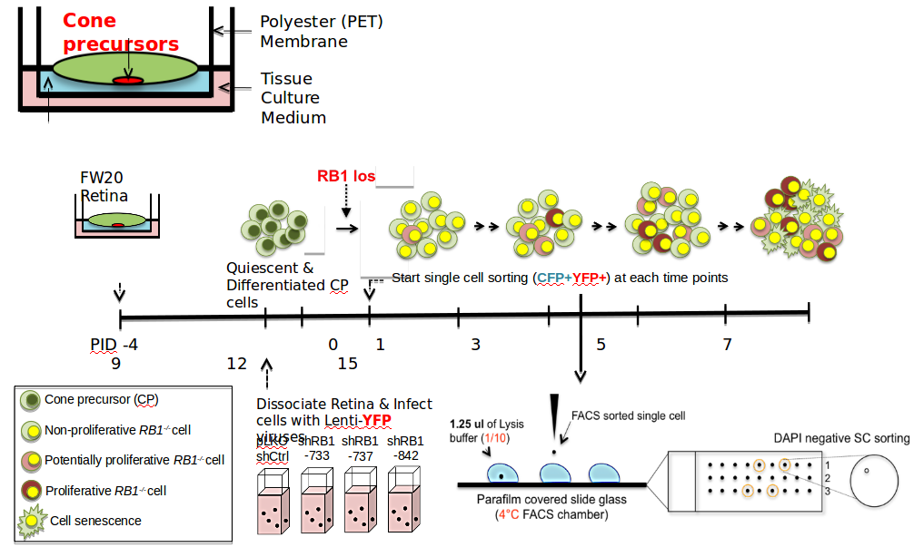
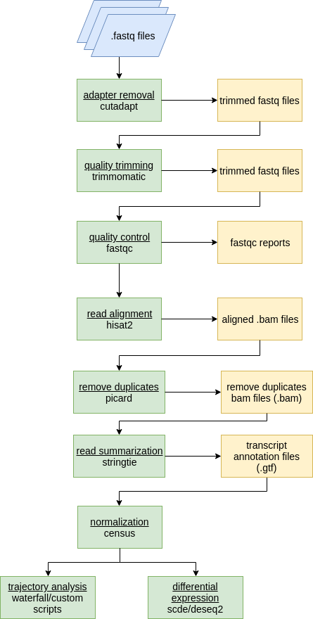
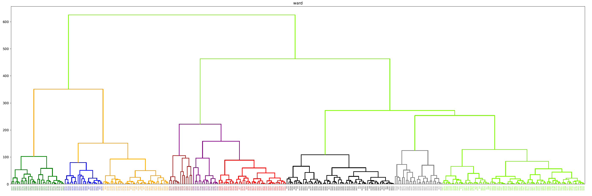
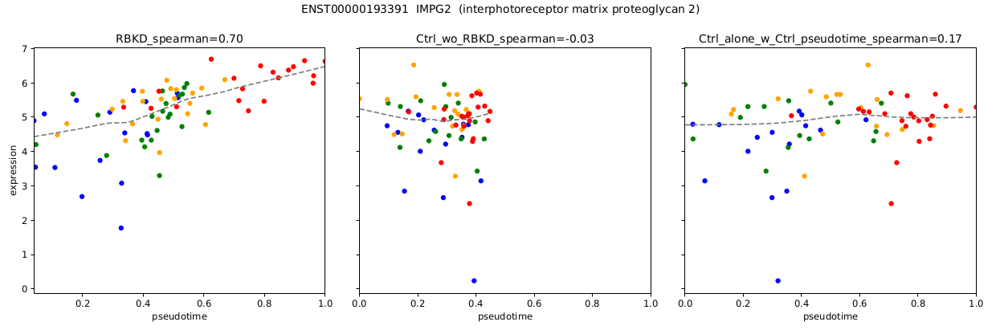
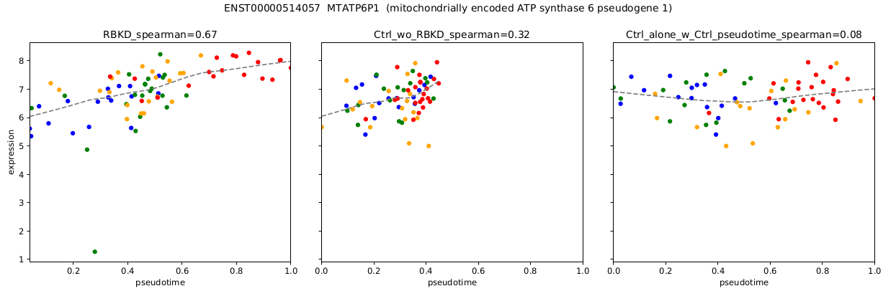
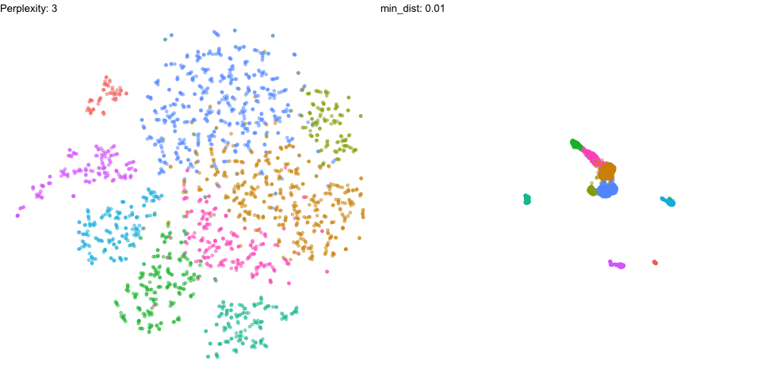

```{r setup, include=FALSE}
options(htmltools.dir.version = FALSE)
knitr::opts_chunk$set(echo = F, warning = F, message = F)

```

```{r xaringan-themer, include = FALSE}
library(xaringanthemer)
mono_accent(
  base_color = "#43418A",
  header_font_google = google_font("Josefin Sans"),
  text_font_google   = google_font("Montserrat", "300", "300i"),
  code_font_google   = google_font("Droid Mono")
)

library(RefManageR)

BibOptions(
  check.entries = FALSE, 
  bib.style = "authoryear", 
  cite.style = "authoryear", 
  style = "markdown",
  hyperlink = FALSE, 
  dashed = FALSE)
myBib = ReadBib("20190412_lab_meeting.bib")
```

```{r}
library(printr)
```


### What are our resources for computing in the lab?

We have two computers with the power to run pipelines and host apps

--

.pull-left[

Thor (ip address 10.134.4.240)

```{r, out.height = 200, out.width = 200}

```
]

--

.pull-right[

SRT server (ip address 10.134.4.105)

```{r, out.height = 200, out.width = 200}

```

]

---

### We also have one back up server located on the USC campus 

USC server (ip address 10.112.120.117)

```{r, out.height = 200, out.width = 200}

```

---

### How can we use these resources?

+ Use [rstudio](10.134.4.105:8787) on one of your servers via your web browser

--

+ Connect in a terminal

--

+ Use a graphical user interface (gui) that manages this connection for you:

1. Cyberduck (Mac) 
2. filezilla (Mac/Windows)
3. PuTTY (Windows)

--

+ Use 'Shiny' Web Apps

--

+ Use jupyter notebooks (python)

---

### Projects

- Transcriptional Response to Rb Loss in the Retinoblastoma Cell of Origin
  Single Cell RNA Sequencing (scRNAseq)

- Changes associated with retinal cone precursor development
  Single Cell RNA Sequencing (scRNAseq)

---

### What are the transcriptomic changes involved in Retinoblastoma Tumorigenesis?

```{r scrna_background, echo=FALSE, out.width="900px"}


```

---

### Study Design

```{r scrna_study_design, echo=FALSE, out.height = 400, out.width=800}

```

---

### Analysis Pipeline

```{r scRNA_analysis, out.height=450, out.width=300}

```

---

### Plot hierarchical clustering
```{r hierarch, echo=FALSE,out.width=900,fig.align='center'}

```

---

### Calculate Principle Components

<style>
    #wrap { width: 900px; height: 1000px; padding: 0; overflow: hidden; }
    #frame { width: 800px; height: 700px; border: 0px solid black; }
    #frame {
        -ms-zoom: 0.75;
        -moz-transform: scale(0.75);
        -moz-transform-origin: 0 0;
        -o-transform: scale(0.75);
        -o-transform-origin: 0 0;
        -webkit-transform: scale(0.75);
        -webkit-transform-origin: 0 0;
    }
</style>

<div id="wrap">
<iframe id="frame" frameborder="0" scrolling="no" src="img/Plot_1.html"></iframe>
</div>
---

### Plot Trajectory

<iframe width="900" height="750" frameborder="0" scrolling="no" src="img/shRB_cluster_colors2.html"></iframe>

---

### Calculate Pseudotime

<iframe width="900" height="750" frameborder="0" scrolling="no" src="img/PT_shRB_shCtrl2.html"></iframe>

---

### Find Genes Correlated with Pseudotime

```{r corr_genes, echo=FALSE,out.width="900px"}



```

---

### Why did this not work well?

--

+ Normalization 

--

+ Batch Effects

--

+ Incomplete Dimensional Reduction

--

+ Naive Clustering Approach

---

###  The Next Generation: Seurat

#### What is Seurat?

Seurat is an R package designed for QC, analysis, and exploration of single-cell RNA-seq data. 

  Written in R so fits easily into existing analysis

---

### Dimensional Reduction by PCA

```{r, out.height=400}
knitr::include_graphics("img/pca.gif", dpi = NA)

```

---

### Graph Construction and Clustering

```{r, out.height = 400}
knitr::include_graphics("img/phenograph.jpg", dpi = NA)

```

---

### Further Dimensional Reduction

#### Several Techniques: most common is tSNE or UMAP

```{r, out.width = 960, out.height = 480}


```

---

### Seurat

Advantages:

1. Batch Correction aka 'integration'.  

2. Label Transfer across experiments  

3. Normalization 

---

### Batch Correction aka integration.  

Seurat v3 implements methods to identify ‘anchors’ across diverse single-cell data types to construct harmonized references, or to transfer information across experiments.
`r pander::pander(RefManageR::Citet(myBib, "stuartComprehensiveIntegrationSingle2018"))`

```{r, out.width = 900}
knitr::include_graphics("img/stuart_integration_diagram.png", dpi = NA)

```


---

### Label Transfer across experiments  

We can use the same batch correction technique to predict the cluster that a cell from a 'query' dataset would fall into in a reference dataset.

Useful for comparison to published studies of retinal transcriptomes

#### Mouse
`r pander::pander(RefManageR::Citet(myBib, c("macoskoHighlyParallelGenomewide2015")))`
#### Mouse/Macaque
`r pander::pander(RefManageR::Citet(myBib, c("pengMolecularClassificationComparative2019")))`
#### Human Bulk
`r pander::pander(RefManageR::Citet(myBib, c("eldredThyroidHormoneSignaling2018", "melloughIntegratedTranscriptionalAnalysis2019")))`


---

### Normalization 

Seurat v3 includes sctransform, a new modeling approach for the normalization of single-cell data. Compared to standard log-normalization, sctransform effectively removes technically-driven variation while preserving biological heterogeneity.

`r pander::pander(RefManageR::Citet(myBib, "hafemeisterNormalizationVarianceStabilization2019"))`

---

### Other Methods 

#### [Scanpy](https://scanpy.readthedocs.io/en/latest/) Strengths and Weaknesses

1. Speed

2. Pseudotime Integration - PAGA

3. Makes several machine learning approaches easier to use

  + Denoising Auto Encoder
  
  `r pander::pander(RefManageR::Citet(myBib, "eraslanSinglecellRNAseqDenoising2019"))`

  + Integrating Datasets (Batch Correction) using Machine Learning 
  
  `r pander::pander(RefManageR::Citet(myBib, "lotfollahiGenerativeModelingLatent2018a"))`
  
  + Transfer Learning
  
  `r RefManageR::Citet(myBib, "lotfollahiGenerativeModelingLatent2018a")`
  
---

#### [bigScale 2](https://github.com/iaconogi/bigSCale2)

* disclaimer: I haven't tried this sofware; and haven't yet gotten a sense of popularity

  + Sensitive and accurate marker detection and classification. No method is used to reduce dimensions, all information is retained.
  
  + Infer gene regulatory networks for any single cell dataset.
  
  + Compress large datasets of any size into a smaller datasets of higher quality, without loss of information.
  
  + Reduce a dataset of many cells to one with fewers cells of increased quality


---

### So many tools!


<blockquote class="twitter-tweet" data-lang="en"><p lang="en" dir="ltr">Too many awesome new datasets, biological findings, ML methods every second of every day. And they are spawning too many new ideas. I luv science &amp; I&#39;m going crazy (in a good way) that I can&#39;t keep up with all the coolness and just have one brain and two hands and no time. Fk!!!!</p>&mdash; ANSHUL KUNDAJE (@anshulkundaje) <a href="https://twitter.com/anshulkundaje/status/1116398619072942080?ref_src=twsrc%5Etfw">April 11, 2019</a></blockquote>
<script async src="https://platform.twitter.com/widgets.js" charset="utf-8"></script>


### What's the most efficient way to pursue our (biological) questions?

#### We need to manage our data well and ask the right questions

---

### Step 1: (General) Data Science for all


.pull-left[

<span style="font-size: 200%">[R for Data Science](https://r4ds.had.co.nz/)</span>

<span style="font-size: 200%">[rstudio cheat sheets](https://www.rstudio.com/resources/cheatsheets/)</span>
]

.pull-right[

```{r}
knitr::include_graphics("img/r4ds.png", dpi = NA)

```

]

---

# Data Science Workflow

```{r}
knitr::include_graphics("img/data-science_cycle.png", dpi = NA)

```

---

### Step 2: Graphical User Interfaces(GUIs) for some

#### Shiny & Plotly!

---

### What is Shiny?

Shiny is an R package that makes it easy to build interactive web apps straight from R.

```{r}
knitr::include_url("https://yihui.shinyapps.io/miniUI/", height = "600px")
```

[Our Apps on Thor (10.134.4.240)](10.134.4.105:3838)

[Our Apps on SRT server (10.134.4.105)](10.134.4.105:3838)

---

There are more possiblities!

Let's think about how graphical tools can help us make progress more quickly

[interactive genome browser using Shiny](https://shiny.rstudio.com/gallery/genome-browser.html)

---

### References

```{r, results = 'asis'}
# pander::pander(purrr::possibly(RefManageR::PrintBibliography(myBib)))
RefManageR::PrintBibliography(myBib, start = 1, end = 4)
```

---

### References cont. 

```{r, results = 'asis'}
# pander::pander(purrr::possibly(RefManageR::PrintBibliography(myBib)))
RefManageR::PrintBibliography(myBib, start = 5, end = 8)
```

---

### Thanks!


